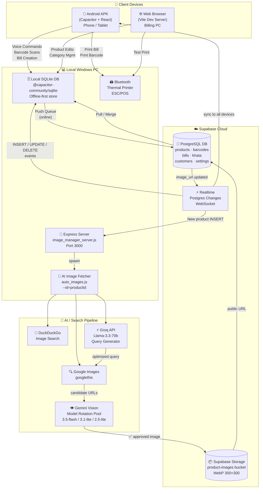
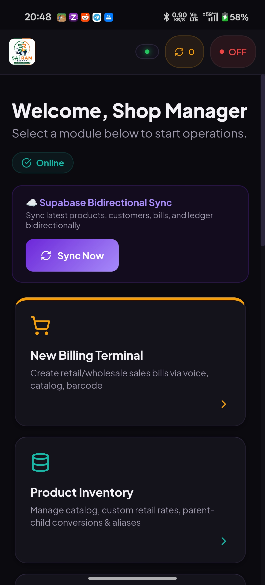
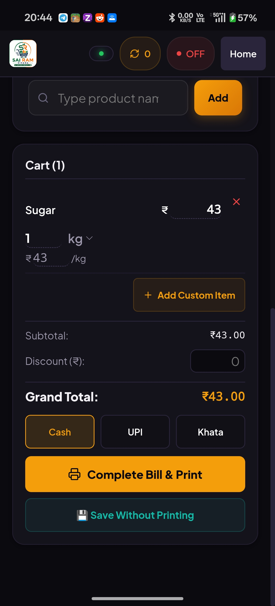

# 🛒 Sai Ram Kirana — Advanced POS & Store Management System

> A production-grade, offline-first hybrid Point of Sale ecosystem built for Indian grocery stores. It runs as an Android APK on your phone and as a web application on your PC, both syncing in real-time through Supabase.

<p align="center">
  
  
  
  
  
  
  
  
  
  
  
  
</p>

---

## 📱 App Overview

Sai Ram Kirana POS is a full-featured store management system built with **React + TypeScript (Vite)**, compiled natively to Android via **Capacitor**, and backed by **Supabase** (PostgreSQL + Realtime + Storage). The system is designed for a real kirana (grocery) store environment — fast, multilingual, offline-capable, and fully Bluetooth-printer integrated.

---

## 🏗️ System Architecture



---

## 🗺️ Application Screens

<p align="center">The app has <strong>10 screens</strong> accessible from the home dashboard:</p>

<div align="center">

| Screen | Purpose |
|:---:|:---|
| **Home** | Dashboard with module navigation + sync status |
| **Billing Terminal** | Voice/scan/catalog billing, MRP/Wholesale toggle |
| **Product Inventory** | Add/edit/delete products, prices, units, aliases |
| **Categories Settings** | Create/manage catalog categories + assign products |
| **Barcode Manager** | Register real barcodes to products |
| **System Barcodes** | Generate internal SYS-XXXXX barcodes for untagged items |
| **Sales History** | Full bill log, cancel/reprint, PDF & WhatsApp share |
| **Khata Ledger** | Customer credit accounts, voice-based payment entry |
| **Analytics Reports** | Cash/UPI/Credit sales totals and transaction counts |
| **System Settings** | Bluetooth printer MAC, UPI QR, store info |

</div>


---

## 📸 Screenshots

---

### 🏠 Home & Sync

<div align="center">
<table>
  <tr>
    <td align="center" width="50%">
      
      <br/><sub><b>Home Dashboard</b></sub>
    </td>
    <td align="center" width="50%">
      
      <br/><sub><b>Database Sync (Queue > 10)</b></sub>
    </td>
  </tr>
</table>
</div>

---

### 💳 Billing Terminal

<div align="center">
<table>
  <tr>
    <td align="center" width="50%">
      
      <br/><sub><b>Billing Terminal — Scan / Search</b></sub>
    </td>
    <td align="center" width="50%">
      
      <br/><sub><b>Billing Terminal — Catalog Browser</b></sub>
    </td>
  </tr>
  <tr>
    <td align="center" width="50%">
      
      <br/><sub><b>Active Bill / Cart View</b></sub>
    </td>
    <td align="center" width="50%">
      
      <br/><sub><b>Bill Totals & Payment Mode</b></sub>
    </td>
  </tr>
  <tr>
    <td align="center" width="50%">
      
      <br/><sub><b>Ultra-Fast Barcode Scanning</b></sub>
    </td>
    <td align="center" width="50%">
      
      <br/><sub><b>Sales History Log</b></sub>
    </td>
  </tr>
</table>
</div>

---

### 📦 Product & Category Management

<div align="center">
<table>
  <tr>
    <td align="center" width="50%">
      
      <br/><sub><b>Add / Edit Product Page</b></sub>
    </td>
    <td align="center" width="50%">
      
      <br/><sub><b>Product Image Manager</b></sub>
    </td>
  </tr>
  <tr>
    <td align="center" width="50%">
      
      <br/><sub><b>Manage Categories</b></sub>
    </td>
    <td align="center" width="50%">
      
      <br/><sub><b>System Barcodes Manager</b></sub>
    </td>
  </tr>
</table>
</div>

---

### 📒 Khata Ledger

<div align="center">
<table>
  <tr>
    <td align="center" width="50%">
      
      <br/><sub><b>Khata — Customer List</b></sub>
    </td>
    <td align="center" width="50%">
      
      <br/><sub><b>Khata — Customer Account Detail</b></sub>
    </td>
  </tr>
</table>
</div>

---

### 📊 Reports & Settings

<div align="center">
<table>
  <tr>
    <td align="center" width="50%">
      
      <br/><sub><b>Analytics & Business Reports</b></sub>
    </td>
    <td align="center" width="50%">
      
      <br/><sub><b>System Settings</b></sub>
    </td>
  </tr>
</table>
</div>

---


The home screen serves as the central navigation hub for the store manager.

**Features:**
- Shows **9 module cards** in a responsive grid, each with an icon, color accent, title, and description
- **Online/Offline indicator** badge showing real-time connectivity status
- **Bidirectional Sync banner** with a prominent "Sync Now" button — pulls and pushes latest products, customers, bills, and Khata ledger data to/from Supabase
- Animated spin state during active sync; shows green "✅ Sync Complete!" on success
- Deep-link URL hash routing (e.g. `#new_bill`, `#products`, `#khata`) for direct screen access

---

## 💳 Billing Terminal (`new_bill`)

The most powerful and heavily-used screen. This is where all customer billing happens.

### Header Controls
- **Customer Selector**: Pick or search a customer; phone contact picker (via native Capacitor Contacts plugin)
- **MRP / Wholesale Toggle**: Switch all item prices between retail MRP and wholesale rates in real-time
- **History shortcut**: Jump to Sales History without losing the current bill

### Voice Billing Engine (V4)
The app has a **multilingual, low-latency voice command system** built specifically for Indian grocery store environments.

- **Tap microphone** → speak in English, Telugu, Hindi, or phonetic mix
- Recognized commands: adding items, removing items, editing quantities, setting customer names, choosing payment mode
- **Intelligent Quantity Parser**: Understands expressions like:
  - *"okatinara kilo"* → 1.5 kg
  - *"adhha kilo"* → 0.5 kg
  - *"pav kilo"* → 0.25 kg
  - *"dedh liter"* → 1.5 L
  - *"two pieces"*, *"oka packet"*, *"rendu"* → exact integers
- **Family Variant Resolver**: If a product name matches multiple sizes/units (e.g. "Ariel 1kg" vs "Ariel 500g"), a variant selector modal appears for the user to pick
- **Voice Learning**: Correct resolutions are recorded to improve future accuracy
- Uses a native **Android SpeechRecognition plugin** for on-device transcription; falls back to browser Web Speech API on PC
- Shows real-time transcript and a visual voice status modal while listening

### Input Methods — 2 Tabs

#### 1. Scan / Search Tab
- **Search by name**: Live fuzzy search with Fuse.js — type a product name and press Enter to add
- **Barcode scan**: Type or scan a barcode; instantly resolves to the matched product and adds it
- Handles unknown barcodes gracefully with a clear error message

#### 2. Catalog Tab
- **Category sidebar** (left): Vertical cards showing category image (rectangular thumbnail), category name (wrapped), and item count — filtered by All, Recent, Fast Selling, individual categories, and Uncategorized
- **Product grid** (right): Product photo, name, and price badge; tap to add to bill
- Separate search bar for filtering within the catalog
- Paginated grid to handle 600+ product catalogs without lag

### Bill Management Panel (Right Column)
- Live bill table with columns: Product name, unit/quantity, unit price, line total, and a ❌ remove button
- **Inline edit** for quantity and unit per line item
- **Discount input**: Flat rupee discount applied to subtotal
- **Subtotal → Discount → Grand Total** breakdown
- **Payment Mode**: Cash / UPI / Credit (Khata) selector with highlighted active mode
- **Complete Bill & Print**: Triggers Bluetooth thermal printer; shows animated confetti on success 🎊
- **Save Without Printing**: Saves bill to local DB without sending to printer
- Draft bill persistence: If you leave the screen with an active bill, it is saved as a recoverable draft

---

## 📦 Product Inventory (`products`)

Full CRUD management of the product catalog.

**Features:**
- Search products by name with live fuzzy filtering
- **Add New Product** form with:
  - Display name, category assignment, retail price, wholesale price
  - Multiple **unit variants** (e.g. "500g @ ₹45", "1kg @ ₹85") — each with their own price
  - **Unit Conversion definitions** (e.g. 1 Sack = 50 kg)
  - Product **aliases** for voice recognition (alternate names a shopkeeper might say)
- **Edit Product**: Modify any field inline; changes sync to Supabase
- **Delete Product**: Soft-delete with confirmation dialog
- Unit selector is smart: shows product-specific units first, then category default units, then generic fallbacks

---

## 🗂️ Categories Settings (`categories`)

Two-tab screen for managing catalog categories and product images.

### Tab 1: Categories
- **Category list** with drag-free ordering via `display_order` field
- Create/Edit modal: Category name, display order, optional image URL
- **Delete** category with confirmation
- Each category card shows thumbnail image, item count, and action buttons

### Tab 2: Product Image Manager
- **Category sidebar** (left): Filter products by category using beautiful vertical cards (rectangular image + category name below)
- **Product grid** (right): All products with their photos; each card shows the product image prominently
- **Upload/Change Image** flow:
  - **Paste URL**: Type or paste any web image URL
  - **Choose File**: Local file picker for selecting photos from device storage
  - **Capacitor Camera**: Take a live photo or pick from gallery on Android
  - **Crop Preview**: A golden dashed 1:1 square overlay mask shows exactly how the final cropped product image will look
  - Images are center-cropped to a **300×300 px WebP** on a canvas and uploaded to Supabase Storage
- **Auto-Fetch Images button**: Triggers the AI image fetcher pipeline for all products without images

---

## 📷 Barcode Manager (`barcode`)

Associates real-world EAN/UPC barcodes with catalog products.

**Features:**
- Search by barcode or product name
- Assign a barcode to a product (creates/updates the `barcodes` table entry)
- View all registered barcodes with their linked product names
- Re-assign barcodes to different products
- Delete barcode associations

---

## 🏷️ System Barcodes (`system_barcodes`)

Generate custom internal barcodes for products that don't have a physical barcode sticker (e.g. loose items, local brands).

**Features:**
- Search through all system barcodes (`SYS-XXXXX` format)
- **Generate new**: Creates a unique system barcode for any product
- **Print Label**: Sends the barcode label directly to the Bluetooth thermal printer; also shows a live preview SVG of the barcode
- **Delete**: Remove a system barcode from the database
- Paginated view for large barcode sets

---

## 📜 Sales History (`history`)

A complete log of all bills ever created.

**Features:**
- Chronological bill list with customer name, date, total, and payment mode badge (Cash/UPI/Credit)
- **Bill detail view**: Tap any bill to see every line item, quantities, prices, and totals
- **Cancel Bill**: Void a previously printed bill (updates status to "Cancelled")
- **Reprint**: Resend the bill to the Bluetooth printer
- **PDF generation**: Download the bill as a formatted PDF
- **WhatsApp Share**: Generate and share the bill summary via WhatsApp
- Filter and navigate between bills; referrer-aware back navigation (returns to home or billing terminal depending on how the user arrived)

---

## 📒 Khata Credit Ledger (`khata`)

A digital version of the traditional Indian "Khata" (credit ledger) for tracking customer balances.

**Features:**
- **Customer list** with outstanding balance displayed for each customer
- **Add Customer**: Name, phone, optional opening credit balance, and a note
- **Customer detail view**:
  - Full transaction timeline showing credit sales and payments
  - Attach a photo receipt/proof to any transaction
  - View attached image proof for past transactions
- **Record Payment**: Enter amount, description, and date manually
- **Voice Payment Entry**: Speak a payment command (e.g. *"Ram paid 500"*) — the system identifies the customer by name, parses the amount, and records the transaction
- **PDF Ledger Export**: Generate a printable Khata summary PDF
- **WhatsApp Share**: Send the ledger statement to the customer
- Customer search with live filtering across all accounts

---

## 📊 Analytics Reports (`reports`)

Business intelligence summary screen.

**Metrics displayed:**
| Card | Value |
|---|---|
| Gross Sales | Total revenue across all bills |
| Cash Sales | Revenue from cash-mode bills |
| UPI Sales | Revenue from UPI-mode bills |
| Credit Sales | Revenue booked as credit (Khata) |
| Total Transactions | Count of active (non-cancelled) bills |
| Pending Khata | Total outstanding credit balance across all customers |

All metrics are computed live from the local database.

---

## ⚙️ System Settings (`settings`)

Configure all hardware and integration settings.

**Sections:**
- **Store Name**: Appears on printed bills and PDF headers
- **UPI ID**: Printed on the bill footer for customer payments
- **UPI QR Code**: Upload a QR code image; the app decodes it automatically using `jsQR` to verify and store the payment address
- **Bluetooth Printer**:
  - Scan for available Bluetooth devices
  - Connect/disconnect to paired printers
  - Set MAC address and printer name manually
  - Toggle auto-reconnect on startup
  - **Test Print**: Send a test receipt to verify the printer connection
  - Adjust QR size parameter for thermal print density

---

## 🤖 AI Image Fetcher Pipeline

A standalone Node.js script (`auto_images.js`) and Express server (`image_manager_server.js`) that runs on your local Windows PC.

### Pipeline (per product):
```
Step 1: DuckDuckGo search → barcode + product name
Step 2: Google search    → barcode + product name
  ↓ (if both fail)
Step 3: Groq AI (Llama-3.3-70b) identifies product category → optimized search query
Step 4: Google search with AI query
Step 5: DDG search with AI query
  ↓
For each candidate image:
  → Validate magic bytes (PNG/JPG/WebP/GIF/BMP) — reject HTML errors
  → Fast Mode: branded products saved directly
  → Vision Mode: ambiguous items verified via Gemini Vision (model pool)
  → If approved → upload to Supabase Storage → update product image_url
```

### Model Rotation Pool
To avoid Gemini API rate limits (429 errors), the script automatically rotates between:
- `gemini-3.5-flash`
- `gemini-3.1-flash-lite`
- `gemini-2.5-flash-lite`

### Single-Product Mode
```bash
node auto_images.js --id=123
```
Fetches the image for one specific product by database ID — used by the autonomous server trigger.

### Autonomous Realtime Worker
`image_manager_server.js` runs on port `3000` and:
- Subscribes to Supabase Realtime `INSERT` events on the `products` table
- When a new product is created from **any client** (Android APK, admin panel, etc.), the server immediately spawns `auto_images.js --id=<newId>` in the background
- Responds via `POST /api/fetch-product-image` for manual triggers from the frontend

---

## 🔄 Bidirectional Sync Engine

Implemented in `src/syncEngine.ts` using Supabase Realtime channels.

**How it works:**
1. **Local-first writes**: All bills, products, and customer edits are saved to local IndexedDB (via `@capacitor-community/sqlite`) first
2. **Push queue**: Changes are queued and pushed to Supabase when online
3. **Pull on connect**: On reconnect, the engine pulls the latest remote state and merges it locally
4. **Realtime subscriptions**: Listens to `postgres_changes` events on all catalog and transaction tables — updates local store instantly without a full pull
5. **Print job relay**: New print jobs inserted by any device are picked up by the host device automatically via realtime

---

## 🖨️ Bluetooth Thermal Printer Integration

Full ESC/POS command generation for 58mm/80mm thermal receipt printers.

**Supported print types:**
- **Customer Receipt**: Store name, customer details, itemized bill, subtotal, discount, grand total, UPI QR code, payment mode
- **Barcode Label**: Product name + Code128 barcode SVG + unit type
- **Test Page**: Connectivity verification print

**Connection modes:**
- Auto-connect on app start
- Manual scan and pair from Settings
- Reconnect button for dropped connections

---

## 🗄️ Database Schema

Managed via Supabase PostgreSQL. Key tables:

| Table | Purpose |
|---|---|
| `products` | Product catalog with prices, units, aliases, image URLs |
| `barcodes` | EAN/UPC and SYS-XXXXX barcode-to-product mappings |
| `customers` | Customer profiles with phone numbers |
| `bills` | Bill headers with totals, payment mode, and status |
| `bill_items` | Line items for each bill |
| `khata` | Customer credit account balances |
| `khata_transactions` | Individual credit/payment entries |
| `catalog_categories` | Product categories with image URLs and display order |
| `product_categories` | Many-to-many product ↔ category mapping |
| `settings` | Store name, UPI ID, printer config, device ID |
| `print_jobs` | Cross-device print job relay queue |

---

## 🚀 Getting Started

### Prerequisites
- Node.js 18+, Java JDK 17+, Android Studio (for APK builds)
- A Supabase project (free tier works)
- A Groq API key (free tier)
- A Google Gemini API key (free tier)

### 1. Clone & Setup
```bash
git clone https://github.com/gorantlasadwik/kiranaapp.git
cd kiranaapp/app
npm install
```

### 2. Configure Environment
Create `app/.env`:
```env
VITE_SUPABASE_URL=your_project_url
VITE_SUPABASE_ANON_KEY=your_anon_key
VITE_GROQ_API_KEY=your_groq_key
VITE_GEMINI_API_KEY=your_gemini_key
```

### 3. Run Web Dev Server (Billing PC)
```bash
npm run dev
# Opens at http://localhost:5173
```

### 4. Run Image Worker Server
```bash
node image_manager_server.js
# Starts on http://localhost:3000
# Listens for new products and auto-fetches images
```

### 5. Build Android APK
```bash
npm run build
npx cap sync android
cd android
./gradlew assembleDebug
# Output: android/app/build/outputs/apk/debug/app-debug.apk
```

### 6. Run Bulk Image Fetch
```bash
node auto_images.js
# Fetches images for ALL products missing images
# Takes 10-30 minutes for 600+ products
```

---

## 🛡️ Security Notes

- `.env` files are **gitignored** — never committed
- APK binaries are **gitignored** — contain compiled env variables
- Pre-compiled static bundles (`admin/public/pos/`) are **gitignored** — may contain embedded credentials
- All API keys are loaded at build time via Vite environment variables

---

## 🛠️ Tech Stack

### Frontend & Native
<p>
  
  
  
  
  
</p>

### Backend & Database
<p>
  
  
  
  
  
</p>

### AI & Search
<p>
  
  
  
  
</p>

### UI, State & Utilities
<p>
  
  
  
  
  
</p>

### Hardware & Scanning
<p>
  
  
  
  
  
</p>

### Voice & Speech
<p>
  
  
</p>
