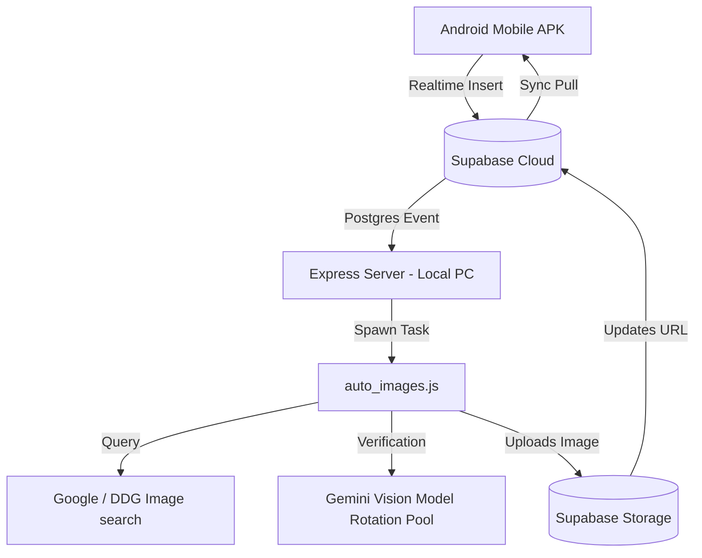

# Sai Ram Kirana POS Ecosystem 🛒✨

An advanced, premium, offline-first hybrid Point of Sale (POS) and inventory manager designed specifically for Indian grocery stores. Built using React, TypeScript, Capacitor, Node.js, and Supabase, this ecosystem integrates intelligent multilingual voice billing, real-time database sync, automatic AI image fetching, and native hardware support.

---

## 🚀 Key Features & Modules

### 1. Multilingual Low-Latency Voice Billing Terminal (V4) 🎙️
* **Mixed-Language Input**: Recognizes and transliterates mixed inputs in English, Telugu, Hindi, and regional scripts in real-time.
* **Intelligent Quantity Parser**: Automatically translates casual verbal measurements (e.g., *"okatinara"* [one and a half], *"half kg"*, *"dedh kilo"*, *"float"* [loose item]) into exact decimal weights, liters, or pack counts.
* **Fuzzy Product Resolution**: Integrates Fuse.js search over local database records to instantly resolve verbal names to catalog matches with high confidence.
* **Billing Actions**: Handles commands to instantly add, edit, remove items, print bills, or toggle wholesale and retail prices on the fly.

### 2. Bidirectional Offline-First Sync Engine 🔄
* **Dual Database Sync**: Uses local IndexedDB storage to record sales, customers, credit transactions, and inventory changes, functioning fully offline.
* **Supabase Bidirectional Sync**: Automatically detects internet connectivity and synchronizes queues bidirectionally.
* **Real-time PostgreSQL Subscriptions**: Listens to changes across database tables (products, barcodes, khata, settings) and updates the local store reactively in milliseconds.

### 3. Smart AI Image Fetcher Pipeline 👁️🤖
* **Multi-Stage Crawler**: Direct barcode DDG/Google lookup → fallback to Llama-3.3-70b-versatile via Groq to identify product categories and formulate high-precision query terms.
* **Fast-Processing Mode**: Standard branded products (e.g., *Colgate*, *Ariel*) are fetched and saved directly in milliseconds without delay.
* **Selective Vision Verification**: Ambiguous or loose products (e.g., *Samosa*, *Local sweets*) automatically activate Gemini Vision checks.
* **Model Rotation Pool**: Rotates request endpoints between `gemini-3.5-flash`, `gemini-3.1-flash-lite`, and `gemini-2.5-flash-lite` to distribute daily quota limits and eliminate 429 rate limit exceptions.
* **Compressed Thumbnails**: Downloads and validates preview thumbnails first to stay below 1M Token-Per-Minute (TPM) limits, downloading the original high-resolution photo only after AI approval.
* **Magic Byte Verification**: Buffers download payloads and checks magic signature bytes to filter out HTTP/JSON errors, raw HTML, and placeholder images.

### 4. Autonomous Backend Worker Server 🔌
* **Realtime Sync Webhook**: An Express.js local server (`image_manager_server.js`) running alongside the database that listens for product insert actions.
* **Auto-Image Fetcher Trigger**: When a new product is added from *any* client (e.g. an Android phone), the server instantly spawns a background worker (`auto_images.js --id=productId`) to find, crop, and assign its product image.

### 5. Interactive Product Image Upload & Crop Manager 📷📐
* **Multiple Inputs**: Upload from local files, capture via native Capacitor Camera/Gallery, or paste a remote web URL directly.
* **1:1 Crop Frame Mask Overlay**: Features a semi-transparent dark crop overlay with a golden dashed square boundary showing the exact center-cropped region before save.
* **Canvas Processing**: Automatically crops the selected preview image on a canvas to a 1:1 ratio, resizes to a standardized 300x300 layout, and uploads as a compressed WebP format.

### 6. Billing Terminal UI/UX Enhancements 💻
* **Responsive Category Grid Cards**: Category items on the left side are formatted as vertical blocks (`flexDirection: "column"`) with 100% width rectangular preview thumbnails. Names are allowed to wrap dynamically, preventing text truncation.
* **Corner Price Badges**: Displays product retail/wholesale prices in high-contrast overlay badges.
* **Parent-Child Conversions**: Handles conversion mapping (e.g. dividing a bulk sack of sugar into 1kg packets).

---

## 🛠️ Technical Architecture



---

## 📦 Getting Started

### 1. Environment Configuration
Create a `.env` file inside the `app/` folder with the following variables:
```env
VITE_SUPABASE_URL=your_supabase_url
VITE_SUPABASE_ANON_KEY=your_supabase_anon_key
VITE_GEMINI_API_KEY=your_google_gemini_api_key
VITE_GROQ_API_KEY=your_groq_api_key
```

### 2. Frontend Development & Build
Install web dependencies and run the Vite server locally:
```bash
cd app
npm install
npm run dev     # Starts local POS dev server
npm run build   # Compiles production assets into dist/
```

### 3. Native Android Build
Copy Vite assets and compile the native package:
```bash
npx cap sync android
cd android
./gradlew assembleDebug
```
*The output APK will be generated under `android/app/build/outputs/apk/debug/app-debug.apk`.*

### 4. Background Server & Image Sync Worker
To run the autonomous image worker server on your Windows PC:
```bash
cd app
node image_manager_server.js
```
*The server will initialize a product cache and listen on port `3000` for realtime changes.*

---

## 🛡️ License and Security

This project contains proprietary integrations for Sai Ram Kirana. Secrets and API credentials are kept locally in `.env` and are strictly excluded from the repository. Builds, dependencies, and configuration templates are managed under `.gitignore`.
